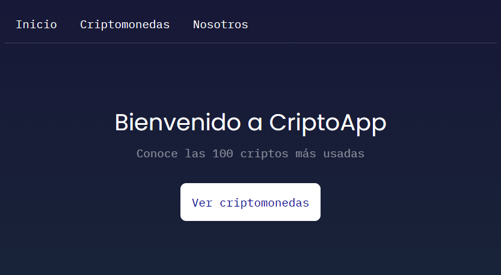

## Descripción del proyecto

Este proyecto es una aplicación web SPA en React que utiliza la API proporcionada por Coincap para obtener datos de criptomonedas.

## Hooks utilizados

En este proyecto se utilizan los siguientes hooks de React:

- `useState`: Se utiliza para gestionar el estado de los componentes funcionales.
- `useEffect`: Se utiliza para realizar efectos secundarios en componentes funcionales, como llamadas a API o suscripciones a eventos.
- `useRef`: Se utiliza para crear una referencia mutable que se mantiene durante toda la vida útil del componente.

## Cómo ejecutar el proyecto

Requisito tener Node.js y npm instalados

1. Clona el repositorio.
2. Navega hasta el directorio del proyecto.
3. Ejecuta `npm install` para instalar las dependencias.
4. Ejecuta `npm start` para iniciar el servidor de desarrollo.

## Dependencias

Este proyecto utiliza las siguientes dependencias adicionales:

- `axios`: Un cliente HTTP basado en promesas para el navegador y node.js. (Reemplazo a fetch)
- `recharts`: Una biblioteca de gráficos para React basada en D3.

## Imagenes

| Screen | Shots |
|--------------|--------------|
|  |  |
|  |  |
